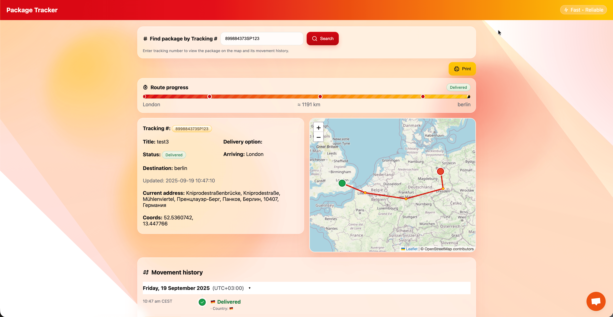
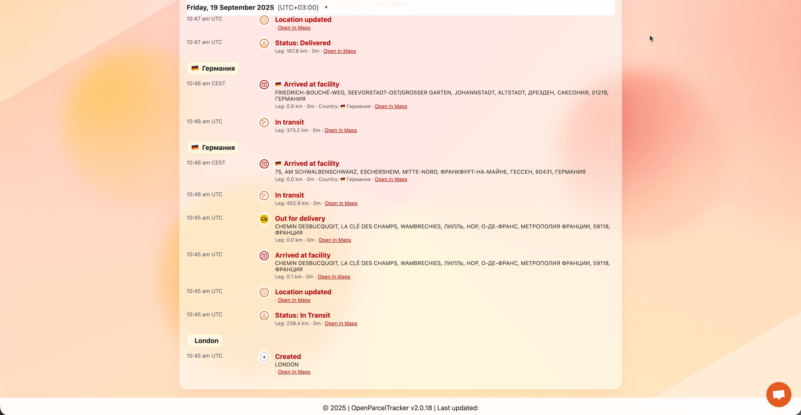
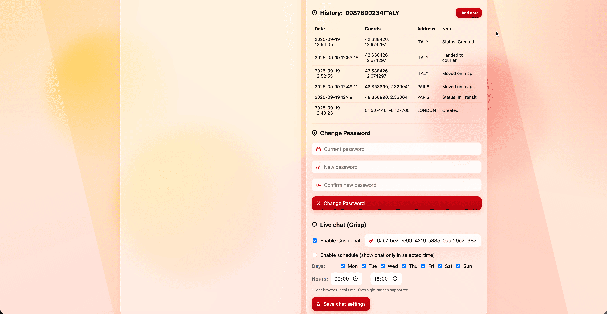
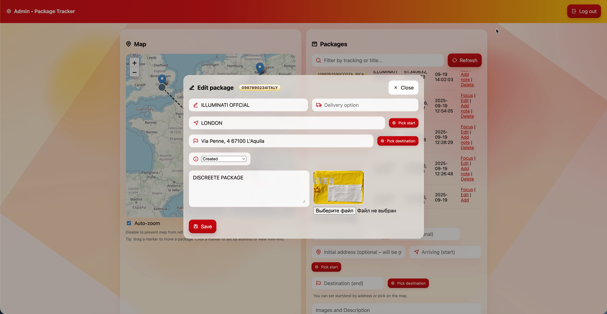

# OpenParcelTracker

OpenParcelTracker — это легковесная, самописная система отслеживания посылок на PHP с поддержкой управления отправлениями, истории перемещений и картографией. Простота установки и гибкость конфигурации позволяют использовать проект для личных и малых бизнес-решений.

## 🚀 Features

### Core Functionality
- **Package Management**: создание, редактирование и управление посылками с уникальными трекинг-номерами
- **Real-time Location Tracking**: GPS-координаты и история передвижений
- **Interactive Maps**: интеграция с OpenStreetMap, перемещение маркеров для точного позиционирования
- **Photo Upload Support**: прикрепление фото и документов
- **Address Geocoding**: автоматическое определение адреса и ручная корректировка координат
- **Status Management**: отслеживание статуса посылки

### User Interfaces
- **Public Tracking Portal**: поиск по трекинг-номеру с визуализацией на карте
- **Admin Panel**: полный интерфейс управления с drag'n'drop корректировкой на карте
- **Responsive Design**: мобильная поддержка
- **Multi-language Support**: расширяемая локализация

### Technical Features
- **Database Flexibility**: MySQL и SQLite
- **Auto-installer**: мастер быстрой установки
- **Version Management**: встроенное обновление через GitHub
- **Security**: безопасная аутентификация
- **RESTful API**: AJAX эндпоинты

## 📸 Screenshots

### 1. Main tracking interface and route display

- Package search by tracking number
- Route visualization on map
- Step-by-step delivery progress
- Current status and address

### 2. Detailed movement history

- Chronological display of all events: facility arrivals, transit, status updates
- One-click address opening on map
- International locations and language support

### 3. Admin panel: package list and map

- List of all shipments with quick filter and actions: edit, delete, add notes
- Drag and drop map markers for position adjustment
- Quick addition of new packages with address and coordinates

### 4. Admin panel: package editing

- Edit all package attributes: title, status, address, photos
- Image upload for identification
- Additional information and notes input

### 5. Additional interface/functionality

- Additional interface/functionality

## 📋 Requirements

- **PHP**: 7.4+
- **Database**: MySQL 5.7+ или SQLite 3.x
- **Web Server**: Apache/Nginx или любой совместимый сервер
- **Extensions**: PDO, JSON, upload

## 🛠️ Installation

### Option 1: Auto-Installer (Recommended)
1. Загрузите файлы на сервер
2. Откройте `http://yourdomain.com/installer.php`
3. Следуйте инструкциям мастера

### Option 2: Manual Installation
1. Загрузите файлы
2. Настройте файл `.env` (см. пример ниже)
3. При первом запуске необходимые таблицы создаются автоматически
4. Проверьте права на запись для папок `data` и `photos`

## 🎯 Usage

- **Публичная страница:** поиск и отслеживание посылок по номеру
- **Админ-панель:** полное управление посылками, локациями и пользователями

## 📊 Database Schema

### packages
- id, tracking_number, title, last_lat, last_lng, last_address, status, image_path, arriving, destination, delivery_option, description, created_at, updated_at

### locations
- id, package_id, lat, lng, address, note, created_at

### users
- id, username, password_hash, is_admin, created_at

## ⚙️ Configuration

### Environment Variables
| Variable     | Description        | Default    |
|--------------|-------------------|------------|
| DB_DRIVER    | mysql/sqlite      | mysql      |
| DB_HOST      | host DB           | localhost  |
| DB_NAME      | имя базы          | tracker    |
| DB_USER      | пользователь      | -          |
| DB_PASS      | пароль            | -          |
| DB_CHARSET   | кодировка         | utf8mb4    |

## 🔒 Security Considerations

- После установки смените пароль администратора
- Используйте надежные пароли для базы данных
- Обеспечьте права на запись для папок
- Рекомендуется использовать HTTPS

## 🔄 Updates

- В админ-панели встроенная проверка и установка обновлений

## 🤝 Contributing

1. Fork, ветка, изменения, тестирование, PR

## 📝 License

Open source (см. LICENSE)

## 👨‍💻 Credits

- Developer: [Buyreadysite.com](https://buyreadysite.com)
- Maps: OpenStreetMap, Leaflet.js

## 🐛 Troubleshooting

- Проверьте настройки базы данных и права доступа
- Следите за лимитами upload в PHP
- Для карт — проверяйте соединение и координаты

---