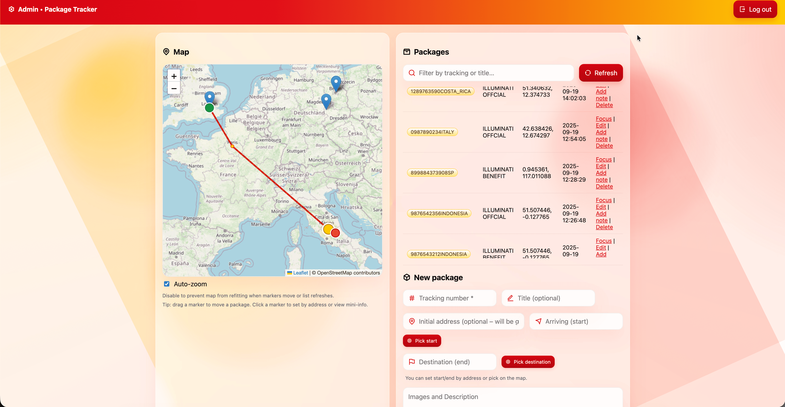

# OpenParcelTracker

OpenParcelTracker is a lightweight, custom-built PHP parcel tracking system supporting shipment management and real-time geolocation.

## 🚀 Features

### Core Functionality
- **Package Management**: Create, edit, and manage parcels with unique tracking numbers
- **Real-time Location Tracking**: GPS coordinates and movement history
- **Interactive Maps**: Integration with OpenStreetMap, drag-and-drop markers for precise positioning
- **Photo Upload Support**: Attach photos and documents
- **Address Geocoding**: Automatic address detection and manual coordinate adjustment
- **Status Management**: Track parcel status

### User Interfaces
- **Public Tracking Portal**: Search by tracking number with route visualization on the map
- **Admin Panel**: Full management interface with drag-and-drop map correction
- **Responsive Design**: Mobile support
- **Multi-language Support**: Extensible localization

### Technical Features
- **Database Flexibility**: MySQL and SQLite
- **Auto-installer**: Quick setup wizard
- **Version Management**: Built-in update via GitHub
- **Security**: Secure authentication
- **RESTful API**: AJAX endpoints

## 📸 Screenshots

### 1. Main tracking interface and route display

- Search parcels by tracking number
- Route visualization on the map
- Step-by-step delivery progress
- Current status and address

### 2. Detailed movement history

- Chronological display of all events: arrival, transit, status updates
- Open address on the map with one click
- Supports international locations and languages

### 3. Admin panel: parcel list and map

- List of all shipments with quick filter and actions: edit, delete, add notes
- Drag markers on the map to adjust positions
- Quickly add new parcels with address and coordinates

### 4. Admin panel: parcel editing

- Edit all parcel attributes: name, status, address, photo
- Upload images for identification
- Enter additional information and notes

### 5. Additional interface/functionality

- Additional interface/functionality

## 📋 Requirements

- **PHP**: 7.4+
- **Database**: MySQL 5.7+ or SQLite 3.x
- **Web Server**: Apache/Nginx or any compatible server
- **Extensions**: PDO, JSON, upload

## 🛠️ Installation

### Option 1: Auto-Installer (Recommended)
1. Upload files to the server
2. Open `http://yourdomain.com/installer.php`
3. Follow the wizard instructions

### Option 2: Manual Installation
1. Upload files
2. Configure the `.env` file (see example below)
3. On first run, required tables are created automatically
4. Check write permissions for `data` and `photos` folders

## 🎯 Usage

- **Public page:** search and track parcels by number
- **Admin panel:** full management of parcels, locations, and users

## 📊 Database Schema

### packages
- id, tracking_number, title, last_lat, last_lng, last_address, status, image_path, arriving, destination, delivery_option, description, created_at, updated_at

### locations
- id, package_id, lat, lng, address, note, created_at

### users
- id, username, password_hash, is_admin, created_at

## ⚙️ Configuration

### Environment Variables
| Variable     | Description        | Default    |
|--------------|-------------------|------------|
| DB_DRIVER    | mysql/sqlite      | mysql      |
| DB_HOST      | DB host           | localhost  |
| DB_NAME      | database name     | tracker    |
| DB_USER      | DB user           | -          |
| DB_PASS      | password          | -          |
| DB_CHARSET   | charset           | utf8mb4    |

## 🔒 Security Considerations

- Change the admin password after installation
- Use strong passwords for the database
- Ensure write permissions for folders
- It is recommended to use HTTPS

## 🔄 Updates

- Built-in update check and installation from the admin panel

## 🤝 Contributing

1. Fork, branch, changes, testing, PR

## 📝 License

Open source (see LICENSE)

## 👨‍💻 Credits

- Developer: [Buyreadysite.com](https://buyreadysite.com)
- Maps: OpenStreetMap, Leaflet.js

## 🐛 Troubleshooting

- Check database settings and access permissions
- Watch for PHP upload limits
- For maps — check connection and coordinates

---